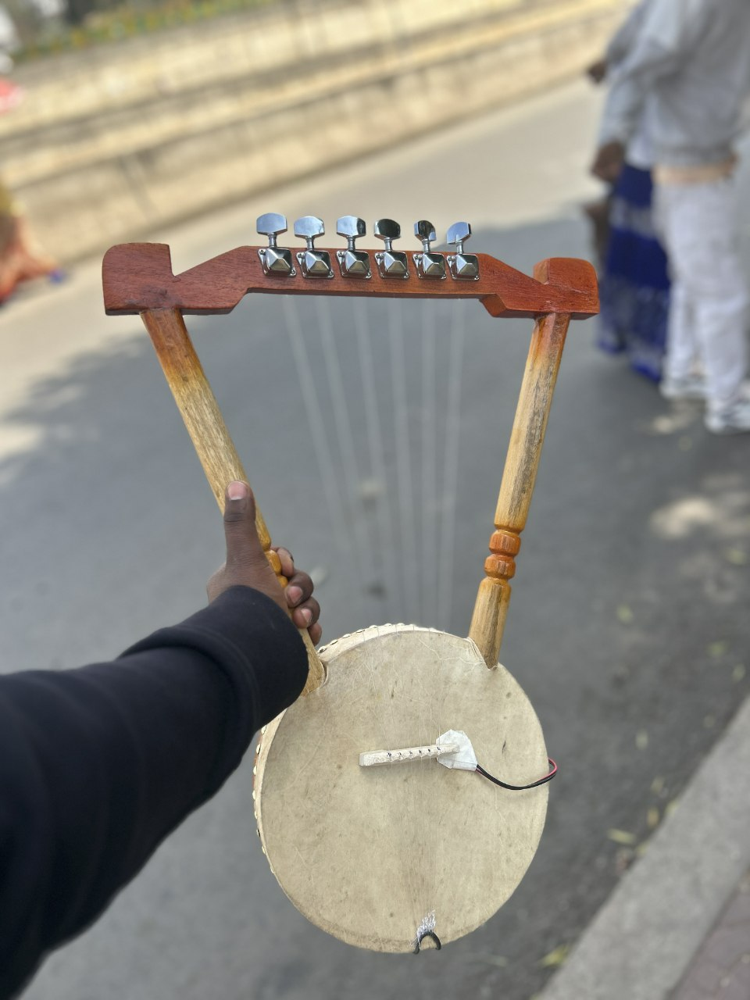
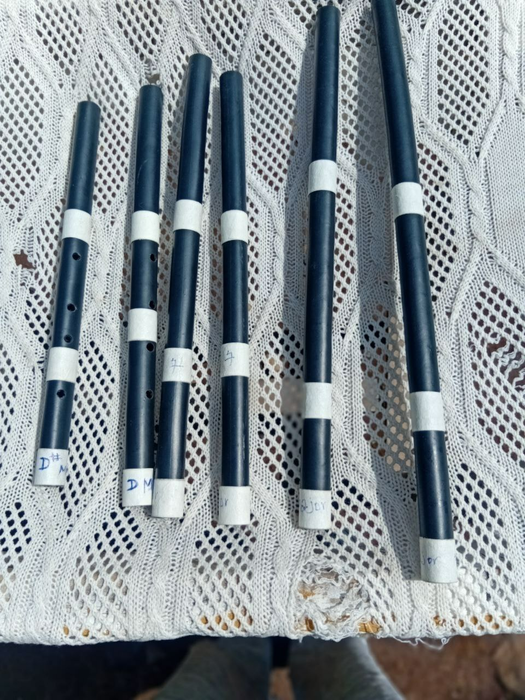

<!DOCTYPE html>
<html lang="am">
<head>
<meta charset="UTF-8">
<meta name="viewport" content="width=device-width, initial-scale=1.0">

<title>ንጋት የዜማ መሳሪያዎች</title>

<link href="https://fonts.googleapis.com/css2?family=Poppins:wght@300;500;700&display=swap" rel="stylesheet">

</head>

<body>

<header>

<h1>🌅 ንጋት የዜማ መሳሪያዎች</h1>

Nigat Melody Instruments

#Order_now

</header>

<section class="products">

<h3>👉 በገና</h3>

<h3>👉 ክራር</h3>

<h3>👉 ቤዝ ክራር</h3>

<h3>👉 መሰንቆ</h3>

<h3>👉 ዋሽንት</h3>

<h3>👉 ቦርሳ</h3>

</section>

<section class="contact">

<section class="contact">

<h2>📦 Order Now</h2>

🚖 በፍጥነት ይዘዙን ባሉበት ቦታ ያለምንም ተጨማሪ ክፍያ እናደርሳለን

<a href="https://t.me/Nigatmelody" target="_blank">
<button class="telegram">📲 Order on Telegram</button>
</a>

<a href="tel:0920300011">
<button class="call">📞 Call Now</button>
</a>

<a href="https://wa.me/251920300011" target="_blank">
<button class="whatsapp">💬 Order on WhatsApp</button>
</a>

</section>
